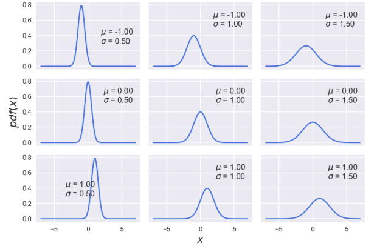
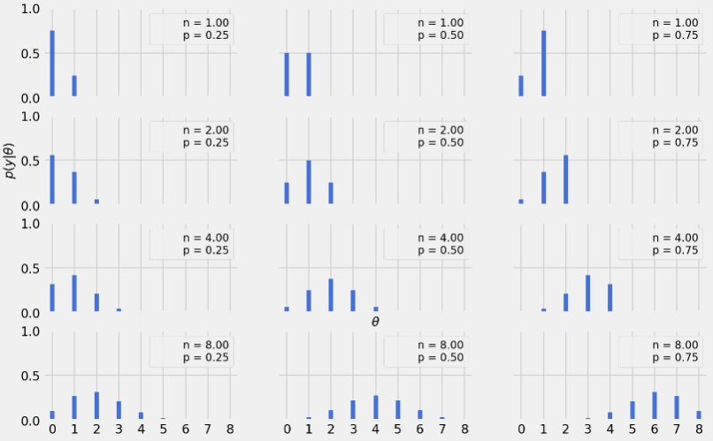

# Outline
* 統計模型
* 機率與不確定性
* 貝葉斯理論以及統計推薦
* 單參數推斷以及coin toss
* 如何選擇先驗
* 如何報告貝葉斯分析結果
* 安裝python libiray

## 統計模型 
大多數統計學導論課程，就像是展示一本菜譜書，每一種統計方法就是一個菜譜，首先，到統計學的廚房取出一個罐頭打開，放點數據上去嚐嚐，然後攪拌，腳板出一個穩定的p值，該值最好<0.05

##### 實驗設計
* 考慮要解決什麼問題
* 打算採取什麼樣的方法
* 怎麼評估本次實驗

##### 統計推斷
貝葉斯模型構建的3個步驟

1. 給定一些數據以及這些數據是如何生成的假設，然後構建模型，通常，這裡的模型都是一些很粗略的近似，不過大多時候也夠用了
2. 利用畢業斯理論將數據和模型結合起來，根據數據和假設推導出邏輯結論，我們稱之為經數據擬合後的模型
3. 根據多重標準，包含真實數據以及對研究問題的先驗知識，判斷模型擬合是否合理

通常我們會發現實驗建模的過程並非嚴格按照上述順序進行，我們有可能跳到其中任何一步，可能是因為寫的code錯了，或是找到某種改進模型的方式，或是我們需要更多數據。

貝葉斯模型是基於機率構建的，因此也稱作機率模型，而機率這個數學工具購很好的描述數據中的不確定性。

## 機率與不確定性

對機率的詮釋仍然有不只一種，對貝葉斯學派而言，機率是一種對某一命題不確定性的衡量

* 假設我們對硬幣一無所知，同時沒有拋硬幣相關的任何數據，那麼正面朝上的機率則介於在0~1之間，換句話說，**在缺少訊息的情況下**，任何情況都有可能會發生，**此時不確定性最大**，但如果我們現在知道硬幣是公平的，那我們認為正面朝上的機率是0.5或是趨近於0.5，此時收集數據，就能夠根據數據來更新我們的假設，從而降低不確定性
* 火星有多大的可存在生命?
* 1816年7月9號是晴天的機率是多少?

值得注意的是，火星上是否有生命，取決於我們目前對火星的了解，以及數據
也就是說，該命題取決於我們當前所掌握的先驗以及數據，而非完全客觀然屬性，因此貝葉斯統計總是被稱作主觀統計，但觀察其好處的話，這是一種相對容易溝通，且較為快速的推論方式

## 機率分佈

最簡單的高斯分佈
</img>
以及他的方程式
$$
pdf_{guassian}(x|\mu, \sigma) = \frac{1}{\sigma \sqrt{2\pi}}e^{\frac{-(x-\mu)^{2}}{2\sigma^{2}}}
$$
上式中，$\mu$和$\sigma$是mean(在此情況下同時也是median以及mode)取值範圍是任意數，$\sigma$則是標準差，衡量離散程度。隨機變數   $x～N(\mu, \sigma)$
>不得不說的一點，了解分佈長相後，會覺得數學式很美，但是還不認識的時候，則會覺得數學式不夠直觀

##### 模型假設
許多模型都假設，如果對服從同個分佈的多個隨機變量進行連續採樣，那麼各個變量的採樣值之間會互相獨立，我們稱這些隨機變量為獨立權同分佈(Indenpendent and Identically distributed) IID
在這樣的情況下，$$
p(x, y) = p(x)p(y)
$$

寫上面這段當然不只是想說這麼簡單的事，而是要舉一個現實世界的例子，時間序列就是不滿足IID的一個典型例子

</img>

測量值與時間是相關的，我們可以看到季節性的波動趨勢(與植物週期性生長和衰敗有關)，另一個則是二氧化碳含量整體性的上升趨勢(trend)

## 貝葉斯定理與統計推斷

再一次完整地闡述一下我們的核心公式

$$
p(H|D) = \frac{p(D|H)p(H)}{p(D)}
$$

從條件機率的定義我們可以得知

$$
p(H, D) = p(H|D)p(D)
$$

同時也可以寫成

$$
p(H, D) = p(D|H)p(H)
$$

聯合機率$p(H,D)=p(D,H)$但條件機率$p(H|D) \neq P(D|H)$
所以我們才需要貝氏定理，一句話解釋條件機率不具交換性 : 

> 我抱著一隻狗，他有很高的機率很可愛，但是我抱著一隻很可愛的東西，他是狗的機率不一定很高，他可能會是貓，小孩，等等

我們重新將$H, D$抽換成假設(hypothesis), 以及資料(Data)，在條件機率的詮釋下能夠說明什麼?

> pass

> 實際上來說，我們能夠在某個假設下收集資料，形成一個機率分佈$P(D|H)$，而透過這個分佈我們能夠生成我們根據資料所產生的假設(或是要稱作模型)$P(H|D)$

按照這個模板我們再次假釋這4個機率

* P(H) : 先驗假設 (prior hypothesis) 
* P(D|H) : 可能性(似然 likelihood) 
* P(H|D) 後驗(posterior hypothesis)
* P(D) : 證據
  
我們會根據資料以及在先驗的可能性，來更新我們的hypothesis，這就是貝氏定理，而後驗又能夠是下一次實驗的先驗，這使得貝氏定理非常適合**序列化的數據分析**，搭配online learning能夠及時修正舊的hypoethsis

證據 : 證據也稱作邊緣可能性(邊緣似然) 證據是模型的參數取遍所有可值的條件下得到指定觀測的機率平均，不過本書大部分不關心這個觀念，我們可以簡單地把它當作皈歸一化參數，大多數情況下能夠被忽略

## 單參數推斷

Binomial distribution

</img>