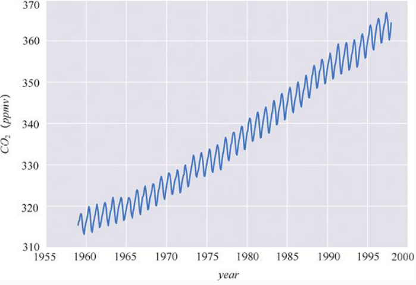

# Outline
* 統計模型
* 機率與不確定性
* 貝葉斯理論以及統計推薦
* 單參數推斷以及coin toss
* 如何選擇先驗
* 如何報告貝葉斯分析結果
* 安裝python libiray

## 統計模型 
大多數統計學導論課程，就像是展示一本菜譜書，每一種統計方法就是一個菜譜，首先，到統計學的廚房取出一個罐頭打開，放點數據上去嚐嚐，然後攪拌，腳板出一個穩定的p值，該值最好<0.05

##### 實驗設計
* 考慮要解決什麼問題
* 打算採取什麼樣的方法
* 怎麼評估本次實驗

##### 統計推斷
貝葉斯模型構建的3個步驟

1. 給定一些數據以及這些數據是如何生成的假設，然後構建模型，通常，這裡的模型都是一些很粗略的近似，不過大多時候也夠用了
2. 利用畢業斯理論將數據和模型結合起來，根據數據和假設推導出邏輯結論，我們稱之為經數據擬合後的模型
3. 根據多重標準，包含真實數據以及對研究問題的先驗知識，判斷模型擬合是否合理

通常我們會發現實驗建模的過程並非嚴格按照上述順序進行，我們有可能跳到其中任何一步，可能是因為寫的code錯了，或是找到某種改進模型的方式，或是我們需要更多數據。

貝葉斯模型是基於機率構建的，因此也稱作機率模型，而機率這個數學工具購很好的描述數據中的不確定性。

## 機率與不確定性

對機率的詮釋仍然有不只一種，對貝葉斯學派而言，機率是一種對某一命題不確定性的衡量

* 假設我們對硬幣一無所知，同時沒有拋硬幣相關的任何數據，那麼正面朝上的機率則介於在0~1之間，換句話說，**在缺少訊息的情況下**，任何情況都有可能會發生，**此時不確定性最大**，但如果我們現在知道硬幣是公平的，那我們認為正面朝上的機率是0.5或是趨近於0.5，此時收集數據，就能夠根據數據來更新我們的假設，從而降低不確定性
* 火星有多大的可存在生命?
* 1816年7月9號是晴天的機率是多少?

值得注意的是，火星上是否有生命，取決於我們目前對火星的了解，以及數據
也就是說，該命題取決於我們當前所掌握的先驗以及數據，而非完全客觀然屬性，因此貝葉斯統計總是被稱作主觀統計，但觀察其好處的話，這是一種相對容易溝通，且較為快速的推論方式

## 機率分佈

最簡單的高斯分佈
</img>
以及他的方程式
$$
pdf_{guassian}(x|\mu, \sigma) = \frac{1}{\sigma \sqrt{2\pi}}e^{\frac{-(x-\mu)^{2}}{2\sigma^{2}}}
$$
上式中，$\mu$和$\sigma$是mean(在此情況下同時也是median以及mode)取值範圍是任意數，$\sigma$則是標準差，衡量離散程度。隨機變數   $x～N(\mu, \sigma)$
>不得不說的一點，了解分佈長相後，會覺得數學式很美，但是還不認識的時候，則會覺得數學式不夠直觀

##### 模型假設
許多模型都假設，如果對服從同個分佈的多個隨機變量進行連續採樣，那麼各個變量的採樣值之間會互相獨立，我們稱這些隨機變量為獨立權同分佈(Indenpendent and Identically distributed) IID
在這樣的情況下，$$
p(x, y) = p(x)p(y)
$$

寫上面這段當然不只是想說這麼簡單的事，而是要舉一個現實世界的例子，時間序列就是不滿足IID的一個典型例子

</img>

測量值與時間是相關的，我們可以看到季節性的波動趨勢(與植物週期性生長和衰敗有關)，另一個則是二氧化碳含量整體性的上升趨勢(trend)

## 貝葉斯定理與統計推斷

再一次完整地闡述一下我們的核心公式

$$
p(H|D) = \frac{p(D|H)p(H)}{p(D)}
$$

從條件機率的定義我們可以得知

$$
p(H, D) = p(H|D)p(D)
$$

同時也可以寫成

$$
p(H, D) = p(D|H)p(H)
$$

聯合機率$p(H,D)=p(D,H)$但條件機率$p(H|D) \neq P(D|H)$
所以我們才需要貝氏定理，一句話解釋條件機率不具交換性 : 

> 我抱著一隻狗，他有很高的機率很可愛，但是我抱著一隻很可愛的東西，他是狗的機率不一定很高，他可能會是貓，小孩，等等

我們重新將$H, D$抽換成假設(hypothesis), 以及資料(Data)，在條件機率的詮釋下能夠說明什麼?

> pass

> 實際上來說，我們能夠在某個假設下收集資料，形成一個機率分佈$P(D|H)$，而透過這個分佈我們能夠生成我們根據資料所產生的假設(或是要稱作模型)$P(H|D)$

按照這個模板我們再次假釋這4個機率

* P(H) : 先驗假設 (prior hypothesis) 
* P(D|H) : 可能性(似然 likelihood) 
* P(H|D) 後驗(posterior hypothesis)
* P(D) : 證據
  
我們會根據資料以及在先驗的可能性，來更新我們的hypothesis，這就是貝氏定理，而後驗又能夠是下一次實驗的先驗，這使得貝氏定理非常適合**序列化的數據分析**，搭配online learning能夠及時修正舊的hypoethsis

證據 : 證據也稱作邊緣可能性(邊緣似然) 證據是模型的參數取遍所有可值的條件下得到指定觀測的機率平均，不過本書大部分不關心這個觀念，我們可以簡單地把它當作皈歸一化參數，大多數情況下能夠被忽略

## 單參數推斷

Coin toss experienment
拋硬幣問題雖然是經典問題，但許多真實問題都包含兩個互斥的結果
0或1，正或負，槭樹或偶數，垃圾郵件或是正常郵件，安全或是不安全，健康或者不健康等

##### 通用模型

首先，我們要抽象出偏差的該念，如果一枚硬幣總是正面朝上，那偏差為1，反面朝上，則偏差為0，如果各佔一半，偏差為0.5，這裡用參數$\theta$表示偏差，用$y$來表示$N$次硬幣試驗正面朝上的次數

我們根據貝葉斯定理，可以這樣說

$$p(\theta | y) \propto p(y|\theta)p(\theta)$$

我們需要指定使用的先驗$p(\theta)$以及可性性$p(y|\theta)$

##### 選擇可能性

本次分析個案是一個iid問題，而且結果只有兩種，所以可以使用(Binomial distribution)二項分佈

$$p(\theta | y) = \frac{N!}{y!(N-y)!}\theta^{y}(1-\theta)^{N-y}$$

而二項分佈基本上會長成像面這樣

</img>

二項分佈是一個可能性(產生data)的合理選擇(正常來說可能性我們會從資料來獲得)，我們的目的就是能夠正確的推斷$\theta$

##### 選擇先驗

這裡我們選則貝葉斯統計中最常見的beta分佈作為先驗

$$
p(\theta | y) = \frac{\Gamma(\alpha + \beta)}{\Gamma(\alpha)\Gamma(\beta)}\theta^{\alpha - 1}(1-\theta)^{\beta - 1}
$$
##### 介紹Beta分佈
* 數學式的部分 
  * 然公式很嚇人，但我們可以看出，除了前面的$\Gamma$function的部分，剩下的形式其實跟二項分佈看起來很像，事實上前面的$\Gamma$function也就只是一個Nomolization，確保該分佈積分值=1
  * 而$\alpha$以及$\beta$則是控制分佈函數的長相
* 我們現在會Python，所以我們可以怒畫一波出來看
</img>
</img>

從$\alpha$以及$\beta$調整所形成的形狀以及各種分佈的關係圖當中，我們能夠略知一二的是

* Beta分佈能夠變成二項分佈，均勻分布，以及高斯分佈也能夠近似exponetional分佈
換句話說，Beta分佈是一個隨著資料越多，參數更新到越後面，能夠變成各種分佈，是一種彈性很好的分佈函數!

##### Beta分佈是二項分佈的Conjugate prior
> 所謂Conjugate prior : 將二項分佈 x Beta分佈之後，仍然得到一個Beta分佈

##### 共軛先驗Conjugate prior能吃嗎?
回憶一下Bayesian theorem希望怎麼樣透過資料來更新分佈

$$p(\theta | y) \propto p(y|\theta)p(\theta)$$

如果一個prior乘上另一個函數後仍然是自己，意味著我們能夠在數學上更好的推理他的方程式，如此一來後驗分佈則會變成一個解析解! 這就是我們定義Conjugate prior的好處

順帶一提，高斯分佈的Conjugate prior就是他自己

##### 推導後驗分佈

現在我們大膽的把兩個很複雜的函數相乘，並且我們知道後驗分佈正比於可能性乘上先驗

$$p(\theta | y) \propto p(y|\theta)p(\theta)$$

$$p(\theta | y) \propto  \frac{N!}{y!(N-y)!}\theta^{y}(1-\theta)^{N-y}\frac{\Gamma(\alpha + \beta)}{\Gamma(\alpha)\Gamma(\beta)}\theta^{\alpha - 1}(1-\theta)^{\beta - 1}$$

這裡我們利用正比的特性，實際上和 $\theta$無關的參數，都和正比於的條件沒關係，所以我們能夠說，階乘項以及$\Gamma$項不影響正比，接著上下兩個兩個簡單的$\theta$函數，我們乘起來整理

$$
p(\theta | y) \propto \theta^{\alpha -1 + y}(1-\theta)^{\beta -1 +N -y}
$$

猛然一看確實是一個beta分佈，如果不管Nomolization constant的部分

$$
P(\theta | y) = Beta(\alpha_{prior}+y, \beta_{prior}+N-y)
$$

有個了後驗的方程式，且參數是先驗以及可能性，我們可以透過`dist.pdf`來計算，接著畫出來
</img>

##### 解釋貝葉斯更新過程
第一行中，實驗次數是0，因此畫出來的3個顏色都是先驗分佈
* 藍色是一個均勻分布(uniform distribution)的先驗
* 紅色則是類似均勻，不過更相信0和1這兩個峰值帶有相對高一些的機率，在這個命題中，可以理解為，這是一個不公平的硬幣，0的機率較高(或是反之)
* 綠色則是一個偏向高斯的分佈，認為這是一個公平的硬幣，正面和反面的機率差不多

* 貝葉斯分析的結果不是點估計，而是區間估計，return一個機率分佈
* 後驗最可能的值是根據分佈的峰值決定
* 後驗分佈的離散程度與我們對參數的不確定性相關，越離散不確定性越高
* 在足夠多資料的情況下，兩個或多個不同先驗的貝葉斯模型會收斂到相同的結果，也就是說，從實際的角度來講，好的先驗能夠更快收斂
* 不同後驗收斂的相同分佈的速度取決於資料以及模型，圖中可以看到藍色和紅色的後驗在超過8次實驗之後就很類似了，而綠色反而在接近150次才和另外兩個分佈接近
* 高斯分佈的先驗未必是好的，本命題就是一個最好的例子，在本命題中高斯分佈的收斂反而最慢
* 最後一點從圖中看不太出來，一步一步的更新後驗和一次性計算得到的結果是一樣的，換句話說，就算是online learning我們也能夠有信心

##### 先驗的影響以及如何選擇合適的先驗
* 有些人傾向使用沒有訊息量的先驗(均勻分布，含糊，或是發散的分佈)，這類先驗對分析過程影響最小
* 本書的作者Gelman, McElreath, Kruschke則建議使用帶有弱訊息的先驗(也被稱作正則化先驗)，通常我們會對參數有一些了解)，例如只能是正數，或是大約知道範圍，或是希望接近0，或某個值
* 強先驗也是可行的，只要信心夠強大，例如在蛋白質折疊的結構計算上

事實上不論是否基於貝葉斯，模型在某個程度上都擁有先驗，即使這裡的先驗沒有明確被表示出來，許多頻率統計學的結果可以被視為貝葉斯模型的特例

我們看上圖，可以看到我們算出來的後驗峰值與頻率派的點估計期望值是一致的
$$
\hat{\theta} = \frac{y}{N}
$$
然而，在對問題不清楚的情況下，我們也可以嘗試各種先驗

##### 報告貝葉斯分析結果
後驗結果如何呈現呢?
畫圖, 或是數學式

$\theta$為硬幣朝上的機率，$y$為$N$次硬幣試驗，正面朝上的次數
我們有了後驗分佈，我們可以說

$$
\theta～ Beta(\alpha, \beta)
$$

且定義
$$
y～ Bin(n=1, p=\theta)
$$

##### 模型註釋
也可以用下圖來表示
</img>

表示的意思是，在第一層，根據了先驗生成了$\theta$，然後通過實驗的可能性，生成了最下面的數據

##### 總結後驗
貝葉斯分析的結果就是後驗分佈，該分佈包含了有關參數在給定數據和模型下的所有訊息，如果可以的話，我們只需要將後驗分佈展示給觀眾即可
但通常我們會這麼做
* 給出mean, median, 以及 mode 讓我們了解該分佈的中心
* 給出variance - 對於單峰分佈ok，但是雙峰分佈以及偏態分佈則會產生誤導
* 我們也會給出最大後驗密度HPD

##### 最大後驗密度(Highest Posterior Density)
</img>
</img>

* 本質上來說就是所謂參數位於開區間的機率是95%
* 但與頻率派的信賴區間卻有一個本質上的不同

##### HPD和Confidence Interval的不同

pass

##### 後驗預測檢查
貝葉斯方法的一個優勢是，一但我們有了後驗分佈，我們等於有了預測
可以根據該後驗來生成prediction
而有了預測之後，隨著時間的推進，我們最好把這兩個值進行一下比對，確保我們的預測沒有和後來觀測到的資料差得太多，步卪機笨上就是一個re-train的訊號

